<div align="center">


# 📰 Go MVC Blog Engine

<a href="https://git.io/typing-svg">
  
</a>

<br/>


<br/>

<a href="#-architecture"><strong>Architecture</strong></a> · <a href="#-roadmap"><strong>Roadmap</strong></a> · <a href="#-setup"><strong>Setup</strong></a>

</div>

---

### 🏗️ Architecture

A strict implementation of the **Service-Repository Pattern** to decouple logic from data.

```mermaid
graph LR
    Req(Http Request) --> Router[🚦 Router]
    Router --> Handler[🎮 Handler]
    Handler --> Service[💼 Service]
    Service --> Repo[🗄️ Repository]
    Repo --> DB[(MySQL)]
    
    style Router fill:#00ADD8,stroke:#333,color:#fff
    style Service fill:#7952B3,stroke:#333,color:#fff
    style Repo fill:#4479A1,stroke:#333,color:#fff
```

<div align="center">


</div>

---

### 🛣️ Module Roadmap

| Phase | Key Concepts | Focus |
| :--- | :--- | :---: |
| **⚙️ Core** | CLI Config, Custom Routing, HTML Engine | `System` |
| **🏛️ Patterns** | Repository Layer, Service Layer, Models | `Arch` |
| **🔐 Auth** | Middleware Guards, Session Logic, Registration | `Security` |
| **🎨 UI/UX** | Form Validation, Error persistence, Flash Msg | `Frontend` |

---

### ✨ Capabilities

| Feature | Description | Status |
| :--- | :--- | :---: |
| **CLI Tools** | `go run . migrate` / `seed` / `serve` | ✅ |
| **Validation** | Form error handling with data persistence. | ✅ |
| **Security** | Route protection via Auth Middleware. | ✅ |
| **Dynamic UI** | Server-side rendering with HTML templates. | ✅ |

---

### 🛠️ Stack

<div align="center">
  
</div>

---

### ⚡ Quick Start

1. **Setup & Config**
   ```bash
   git clone <repo>
   # Update config.yml with MySQL creds
  ```

2. **Database Init**
  ```Bash
  go run . migrate
  go run . seed
```

3. **Launch**
   ```Bash
   go run . serve
   ```
<div align="center">

Author: Shivam


</div>