# 🏗️ System Architecture

The API follows a clean, layered approach to separate concerns and ensure maintainability.

## Diagram

```mermaid
graph LR
    User([📱 Client]) -->|JSON| API[🚀 Gin Server]

    subgraph "Logic Layers"
        API --> Middleware{🛡️ Auth Guard}
        Middleware --> Handlers[🎮 Handlers]
        Handlers --> DB[(🗄️ Database)]
    end

    subgraph "Security"
        Middleware -.-> JWT[🔐 JWT Verify]
    end

    style API fill:#00ADD8,stroke:#333,stroke-width:2px,color:#fff
    style DB fill:#336791,stroke:#333,stroke-width:2px,color:#fff
    style Middleware fill:#00C7B7,stroke:#333,stroke-width:2px,color:#fff
```

## Internal Structure

The project is structured as follows:

- **`api/`**: Contains HTTP request samples.
- **`db/`**: Database initialization and table creation.
- **`middlewares/`**: Authentication middleware.
- **`models/`**: Data models and database operations.
- **`routes/`**: Route definitions and handlers.
- **`utils/`**: Utility functions (JWT, Hashing).
