<div align="center">

# 🎟️ Event Booking API

### A Secure, Scalable Event Management Backend


<br/>

[**Overview**](#-overview) • [**Features**](#-features) • [**Architecture**](#-architecture) • [**Getting Started**](#-getting-started)

</div>

---

## 🌩️ Overview

This project implements a **production-style RESTful API** for managing events and user registrations.  
It focuses on **secure authentication**, **authorization**, and **SQL-backed persistence**, following modern backend engineering practices.

Designed as a **hands-on learning project**, the API mirrors real-world workflows used in scalable backend systems.

---

## 🎨 Design Principles

- ⚡ **High performance** request handling using Gin
- 🔐 **Security-first** authentication & authorization
- 🧩 **Clean, modular architecture**
- 🧠 **Predictable API behavior**
- 🎯 **Frontend-ready API contracts**

> While UI is not included, the API is built to seamlessly power modern web and mobile interfaces with smooth, animation-friendly user experiences.

---

## 🏗️ Architecture

```mermaid
graph TD
    Client[📱 Client / Frontend] -->|HTTP / JSON| API[🚀 Gin API Server]

    subgraph "Backend Core"
        API --> Middleware[🛡️ Auth & Validation Middleware]
        API --> Handlers[🎮 Route Handlers]
        Handlers --> Services[💼 Business Logic]
        Services --> Models[📦 Data Models]
        Models --> DB[(🗄️ SQL Database)]
    end

    Middleware -.-> JWT[🔐 JWT Verification]
```

<div align="center">


</div>

## ✨ Features

| Module                  | Description                                                     |
|------------------------|-----------------------------------------------------------------|
| **🔐 Authentication**  | User signup & login with JWT-based authentication.              |
| **🛡️ Authorization**  | Route protection and ownership-based access control.            |
| **📅 Event Management**| Create, read, update, and delete events.                        |
| **🧾 Registrations**   | Register and cancel participation in events.                   |
| **🔑 Security**        | Password hashing, token validation, safe SQL queries.           |
| **⚡ Performance**     | Prepared statements and efficient database interactions.        |

---

## 🛠️ Getting Started

### Prerequisites

- Go (v1.22+)
- SQL Database (MySQL / PostgreSQL / SQLite)

### Installation

```bash
# Initialize module
go mod init <module-name>

# Run the application
go run .
```
Ensure your database is configured and running before starting the server.

---

## 🔮 Extensibility

This API is designed to be extended with:

- Frontend applications (Web / Mobile)
- Pagination & filtering
- Role-based access control
- API documentation (Swagger / OpenAPI)
- Caching & rate limiting

---

<div align="center">

**Author: Shivam**
Backend-first. Production-inspired. Learning-driven.

</div>
