<div align="center">


# 🎟️ Event Booking API

<a href="https://git.io/typing-svg">
  
</a>

<br/>


<br/>

<a href="#-features"><strong>Features</strong></a> · <a href="#-architecture"><strong>Architecture</strong></a> · <a href="#-setup"><strong>Setup</strong></a>

</div>

---

### 📖 Overview

This project implements a **production-style RESTful API** for managing events and user registrations. It focuses on the intersection of **Security**, **Scalability**, and **Modular Design**.


---

### 🏗️ System Architecture

The API follows a clean, layered approach to separate concerns and ensure maintainability.

```mermaid
graph LR
    User([📱 Client]) -->|JSON| API[🚀 Gin Server]
    
    subgraph "Logic Layers"
        API --> Middleware{🛡️ Auth Guard}
        Middleware --> Handlers[🎮 Handlers]
        Handlers --> DB[(🗄️ Database)]
    end
    
    subgraph "Security"
        Middleware -.-> JWT[🔐 JWT Verify]
    end

    style API fill:#00ADD8,stroke:#333,stroke-width:2px,color:#fff
    style DB fill:#336791,stroke:#333,stroke-width:2px,color:#fff
    style Middleware fill:#00C7B7,stroke:#333,stroke-width:2px,color:#fff
```

<div align="center">



---

### ✨ Core Capabilities

| Feature | Description | Status |
| :--- | :--- | :---: |
| **🔐 Auth Flow** | User signup/login with Bcrypt hashing & JWT. | ✅ |
| **📅 Event CRUD** | Create, View, Update, and Delete events. | ✅ |
| **🛡️ Protected** | Only event creators can edit/delete their data. | ✅ |
| **🧾 Registration** | Multi-user event participation logic. | ✅ |

---

### 🛠️ Tech Stack Icons

<div align="center">
  
</div>

---

### ⚡ Installation & Setup

1. **Clone & Navigate**
   ```bash
   cd event-booking-api
   ```
   
2. **Install Dependencies**
   ```bash
   go mod download
   ```
   
3. **Run the Application**
   ```bash
   go run main.go
   ```

<div align="center">

Author: Shivam Building scalable backends, one line at a time.


</div>